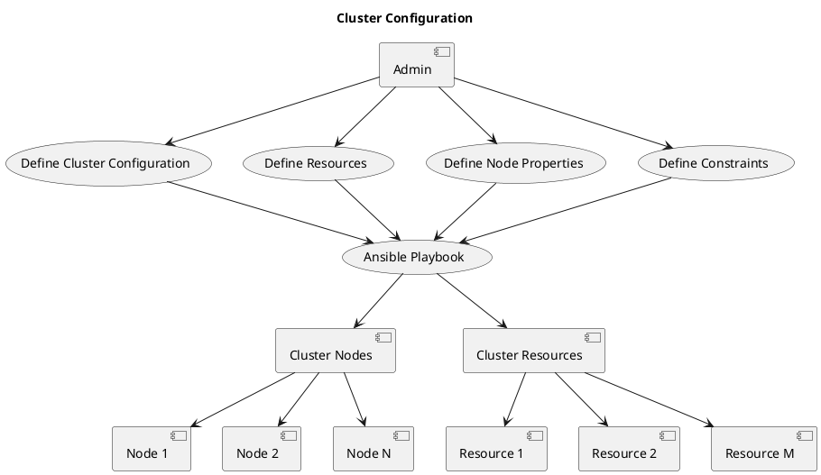
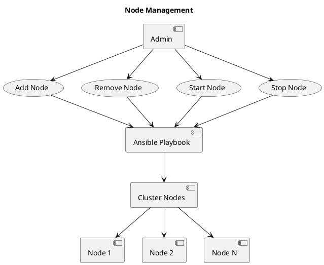
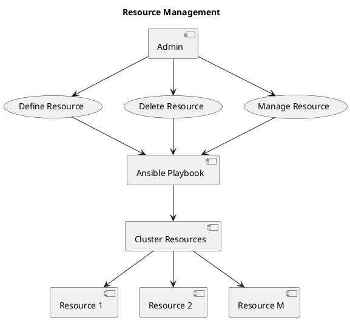
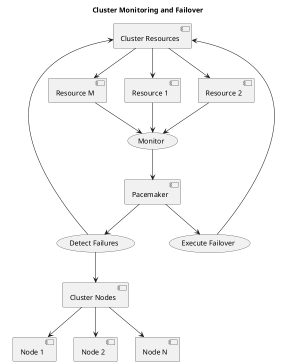

设计一个基于 Ansible 和 Pacemaker 的集群管理方案可以分为以下几个主要部分，包括集群配置、节点管理、资源管理、集群监控和自动故障转移。以下是每个部分的功能和设计方案的简要描述，以及相应的 UML 功能流程图和原理图：

### 集群配置

**功能描述：** 集群配置用于定义整个集群的参数和属性，包括节点列表、资源定义、故障域设置等。

**设计方案：** 使用 Ansible Playbooks 来自动化配置集群参数。创建一个包含所有集群配置信息的 Ansible 变量文件，并编写 Ansible Playbooks 来将配置应用到所有节点。

**UML功能流程图：**

### 节点管理

**功能描述：** 节点管理包括添加、删除、启动和停止集群中的节点。

**设计方案：** 使用 Ansible 来执行节点的管理操作。编写 Ansible Playbooks 来添加、删除、启动和停止节点。通过 Pacemaker 自动检测节点状态变化。

**UML功能流程图：**

### 资源管理

**功能描述：** 资源管理涉及定义和管理集群中的各种资源，例如虚拟IP、数据库、Web 服务器等。

**设计方案：** 使用 Ansible 来自动创建、删除和管理资源。编写 Ansible Playbooks 来定义资源属性，并使用 Pacemaker 来自动管理这些资源。

**UML功能流程图：**

### 集群监控和自动故障转移

**功能描述：** 集群监控用于实时监测节点和资源的状态，自动检测故障并执行故障转移。

**设计方案：** 使用 Pacemaker 的监控功能来监测集群状态。当节点或资源出现故障时，Pacemaker 可以自动执行故障转移操作。

**UML功能流程图：**

以上是一个基于 Ansible 和 Pacemaker 的集群管理方案的简要设计。通过 Ansible 进行集群配置和节点管理，使用 Pacemaker 进行资源管理和监控，可以实现高可用性集群的自动化管理。注意，具体实现可能需要更详细的配置和脚本编写。